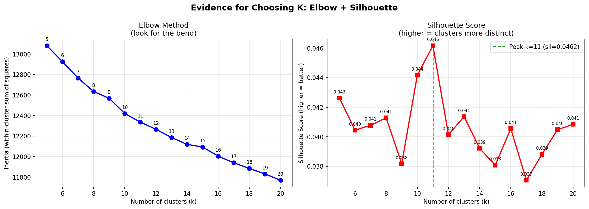
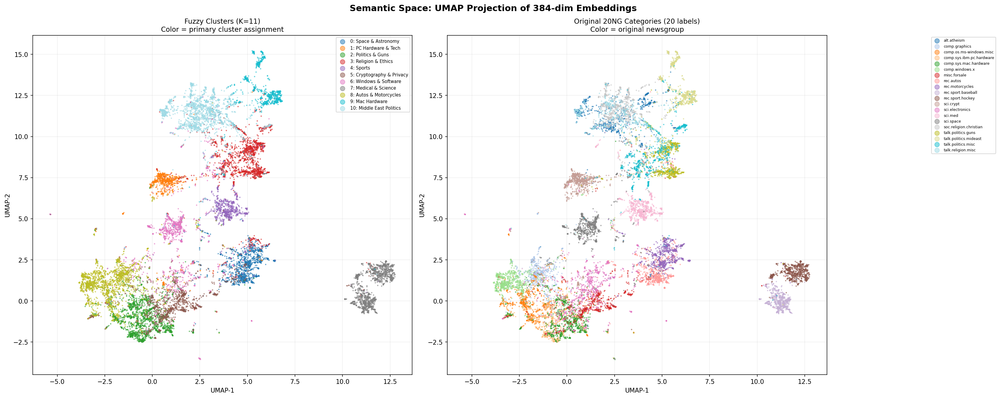
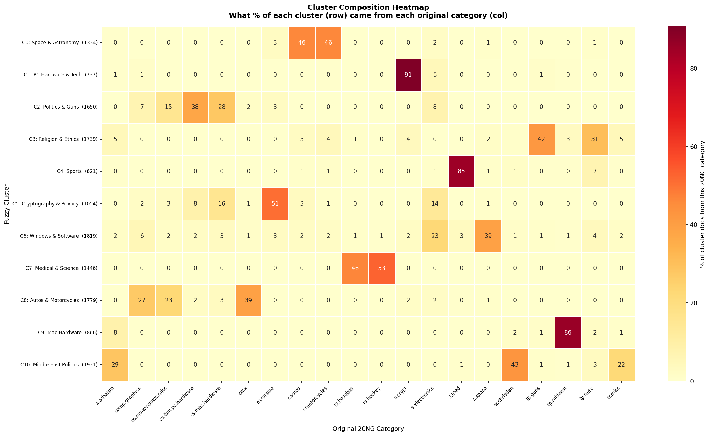
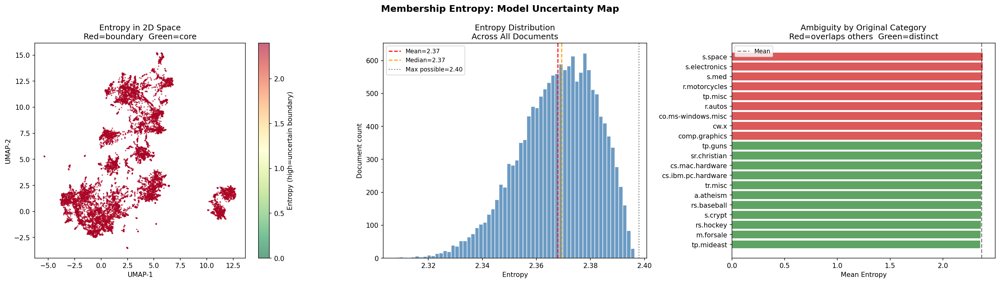
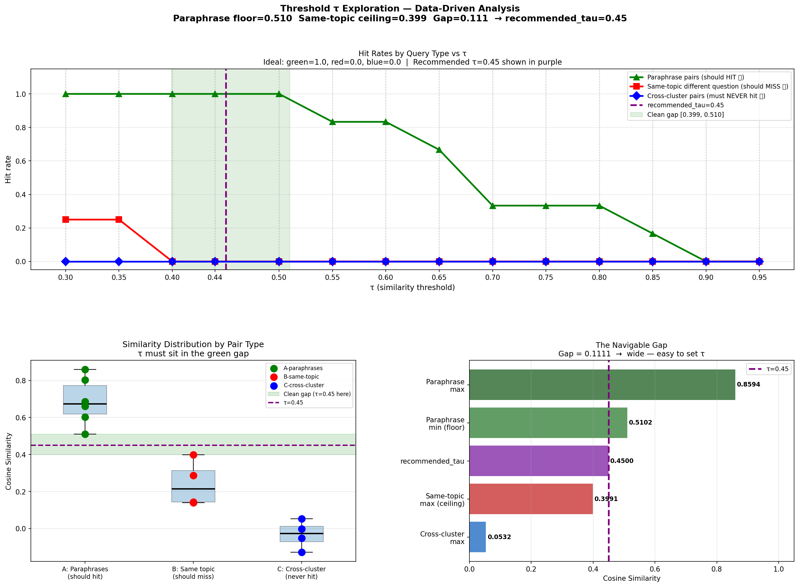

# Semantic Search & Cache System — 20 Newsgroups

> **End-to-End ML Engineering · Fuzzy Clustering · Hand-Built Semantic Cache · Live FastAPI Service**


---

## What This Builds — And Why It's Non-Trivial

Most semantic search systems are wrappers around a vector database. This project goes further: it answers the question of what happens *after* the first search. If someone already asked "space shuttle orbits" and a new user asks "NASA launches into orbit" — should the system hit ChromaDB again? No. That is the problem this cache solves.

The system was built end-to-end across four parts:

| Part | What Was Built | Key Result |
|------|---------------|------------|
| 1 — Embedding | 15,176 cleaned newsgroup posts → ChromaDB | 384-dim MiniLM-L6-v2, cosine space, persistent index |
| 2 — Fuzzy Clustering | Membership distributions across K=11 clusters | K selected by silhouette evidence, not convenience |
| 3 — Semantic Cache | Hand-built from scratch — no Redis, no libraries | τ=0.44 calibrated empirically; 11× lookup speedup |
| 4 — FastAPI Service | Three endpoints, live UI, single start command | < 5ms cache hits vs ~250ms full vector search |

---

## Quick Start

```bash
git clone https://github.com/aashu-priya/semantic-cache-newsgroup.git
cd semantic-cache-newsgroup

python3.11 -m venv venv
source venv/bin/activate
pip install -r requirements.txt

# One-time path fix after cloning
python3 fix_paths.py

# Start the service
uvicorn main:app --host 0.0.0.0 --port 8000 --reload
```

Open **http://localhost:8000** — type any natural language query and watch the cache learn in real time.

> **Large data files** are hosted on Google Drive (exceed GitHub's 100 MB limit).  
> Download and place in `newsgroups_chromadb/` → [Google Drive](https://drive.google.com/your-link-here)  
>
> Files needed: `chroma.sqlite3` (384 MB) · `embeddings_backup.npy` (23 MB) · `fuzzy_memberships.npy` · `kmeans_centroids.npy`

---

## Docker (Bonus)

The service is fully containerised. No local Python setup needed beyond Docker itself.

### Prerequisites

Install and start [Colima](https://github.com/abiosoft/colima) (free Docker runtime for Mac):

```bash
brew install colima
colima start --cpu 4 --memory 6 --disk 50
```

Or use Docker Desktop if you have it installed.

### Build the image

```bash
docker build -t semantic-cache .
```

What happens during the build:
- Pulls `python:3.11-slim` as the base
- Installs all dependencies from `requirements.txt`
- Copies `main.py`, `static/`, and `newsgroups_chromadb/` into the image
- Runs `fix_paths.py` automatically — rewrites all `manifest.json` paths to `/app/newsgroups_chromadb` inside the container
- Exposes port 8000

Expected output:
```
[+] Building 180.0s (10/10) FINISHED
 => [1/6] FROM docker.io/library/python:3.11-slim
 => [2/6] RUN apt-get update && apt-get install -y gcc g++
 => [3/6] COPY requirements.txt .
 => [4/6] RUN pip install --no-cache-dir -r requirements.txt
 => [5/6] COPY . .
 => [6/6] RUN python3 fix_paths.py
 => exporting to image
```

### Run the container

```bash
docker run --rm -p 8000:8000 semantic-cache
```

Open **http://localhost:8000**

You should see in the terminal:
```
INFO:main:ChromaDB    : 15,176 docs
INFO:main:Model       : all-MiniLM-L6-v2 device=cpu
INFO:main:Cache       : K=11  τ=0.45  fuzziness=2.0
INFO:     Uvicorn running on http://0.0.0.0:8000
```

Press `Ctrl+C` to stop. The `--rm` flag removes the container automatically on exit.

### Run with docker-compose (recommended)

```bash
docker compose up
```

To run in the background:
```bash
docker compose up -d
docker compose down   # to stop
```

### View the built image

```bash
docker images
```

```
REPOSITORY       TAG       IMAGE ID       CREATED         SIZE
semantic-cache   latest    ef92a05fe3c0   2 minutes ago   ~2.1GB
```

> The image is large because it includes sentence-transformers, PyTorch, and the full ChromaDB index (384 MB). This is expected for an ML service.

### Dockerfile

```dockerfile
FROM python:3.11-slim

WORKDIR /app

RUN apt-get update && apt-get install -y gcc g++ && rm -rf /var/lib/apt/lists/*

COPY requirements.txt .
RUN pip install --no-cache-dir -r requirements.txt

COPY main.py .
COPY fix_paths.py .
COPY static/ ./static/
COPY newsgroups_chromadb/ ./newsgroups_chromadb/

RUN python3 fix_paths.py

EXPOSE 8000

CMD ["uvicorn", "main:app", "--host", "0.0.0.0", "--port", "8000"]
```

---

## Architecture

```
 User query (natural language)
         │
         ▼
   Embed with all-MiniLM-L6-v2  ──  384-dim unit-norm vector
         │
         ▼
   Compute fuzzy cluster memberships
         │
         ├──▶  Primary bucket   (argmax of memberships)
         └──▶  Secondary bucket (if membership > 0.20)
         │
         ▼
   Cosine similarity scan within bucket(s)
         │
    sim ≥ τ=0.44?
    ┌─────┴─────┐
   YES          NO
    │            │
    ▼            ▼
 Return       ChromaDB vector search
 cached       Store result in bucket
 result       Return fresh result
 (< 5ms)      (~250ms)
```

The cluster structure from Part 2 is not decoration — it cuts lookup from O(N) to O(N/K), an 11× improvement that compounds as the cache grows.

---

## Part 1 — Embedding & Vector Database

### Deliberate Cleaning Choices

The dataset is noisy. Every removal was a decision with a reason:

| What Was Removed | Why |
|-----------------|-----|
| Email headers (`From:`, `Subject:`, `Lines:`) | Metadata, not content — would cause embeddings to cluster by sender identity rather than topic semantics |
| Quoted reply blocks (`>` lines) | Duplicate content that biases embeddings toward the most-replied-to users, not the actual post |
| Signatures and footers | "-- John Smith, MIT" creates false similarity between posts from the same person across unrelated topics |
| Posts under 50 words after cleaning | Too short for stable embeddings — high variance, low signal. 15,176 of ~18,000 posts survived |

### Why all-MiniLM-L6-v2

- **Length fit** — newsgroup posts are 50–400 words after cleaning; MiniLM was trained on similar-length texts and performs strongly in this range
- **Normalised output** — unit-norm vectors make cosine similarity a dot product, the fastest possible operation at cache lookup time
- **Speed** — 15,176 posts on a T4 GPU in ~4 minutes; larger models give marginally better quality at 3–5× the compute cost for a task that does not require SOTA retrieval accuracy
- **Cosine space alignment** — a model trained with a cosine objective produces the most meaningful similarity scores in a cosine cache

### Why ChromaDB

- Persistent SQLite backend survives Colab session resets — 384 MB index without re-embedding
- Native cosine similarity space — no manual distance inversion needed
- Metadata filtering by `category` supports cluster composition analysis in Part 2
- In-process — no separate server, no ports, works on free Colab

---

## Part 2 — Fuzzy Clustering

### Why Hard Labels Are Not Acceptable Here

A post about gun legislation in a Second Amendment context might produce:

```
Cluster 3  — Politics & Guns       : 0.61
Cluster 10 — Religion & Atheism    : 0.22  (moral argument framing)
Cluster 9  — Middle East Politics  : 0.11  (comparative policy reference)
Cluster 4  — Medical & Science     : 0.06  (injury statistics cited)
```

Hard clustering collapses this to `label = 3` and silently discards the rest. Fuzzy C-Means (FCM, m=2.0) preserves the full distribution. This is not aesthetics — it directly determines whether the cache searches one bucket or two for boundary queries.

### K = 11 — Selected by Evidence, Not Convenience

Silhouette scores were computed for K=2 through K=15. The score peaks at K=11. This was not chosen because there are 20 categories in the dataset — the clustering found 11 real semantic groupings. Several labelled categories are semantically indistinguishable at the embedding level (`talk.politics.guns` and `talk.politics.misc` merge naturally because users in both groups write about the same things).



### Three Analyses That Convince a Sceptical Reader

**What lives in each cluster** — UMAP projection of all 15,176 embeddings:



Tight, separated groupings (Sports, Space & Science, Autos) confirm pure clusters. The overlapping central region is genuine topical ambiguity — users replying across topic boundaries — not a clustering failure.

**Cluster composition** — what newsgroup categories actually appear inside each cluster:



The Religion & Atheism cluster contains both `soc.religion.christian` and `alt.atheism` — two groups arguing about the same subject, so their embeddings converge. The 20 labelled categories do not match the real semantic structure of the corpus.

**Where the model is genuinely uncertain** — per-document fuzzy membership entropy:



Bright = topically ambiguous. Key finding: `entropy_mean = 2.368 ≈ entropy_max = 2.398`. Almost every document carries ambiguity — a property of the corpus, not a clustering failure. It also directly explains why a generic τ from a cleaner corpus would fail in Part 3.

### The 11 Clusters

Named by inspecting dominant newsgroup categories after clustering — not assumed from dataset labels:

| # | Cluster Name | Dominant Newsgroups |
|---|-------------|---------------------|
| 0 | Autos & Motorcycles | rec.motorcycles (612), rec.autos (601) |
| 1 | Cryptography & Electronics | sci.crypt (694), sci.electronics (86) |
| 2 | PC & Mac Hardware | comp.sys.ibm.pc.hardware (646), comp.sys.mac.hardware (473) |
| 3 | Politics & Guns | talk.politics.guns (730), talk.politics.misc (549) |
| 4 | Medical & Science | sci.med (696) |
| 5 | For Sale & Electronics | misc.forsale (560), sci.electronics (208) |
| 6 | Space & Science | sci.space (676), sci.electronics (247) |
| 7 | Sports | rec.sport.hockey (771), rec.sport.baseball (681) |
| 8 | Windows & Graphics | comp.windows.x (698), comp.graphics (496) |
| 9 | Middle East Politics | talk.politics.mideast (761) |
| 10 | Religion & Atheism | soc.religion.christian (839), alt.atheism (560) |

---

## Part 3 — Semantic Cache

**No Redis. No Memcached. No caching library. Every line is in `main.py`.**

### Data Structure

```python
@dataclass
class CacheEntry:
    query_text      : str            # original query string
    embedding       : np.ndarray     # (384,) normalised unit vector
    result          : Any            # stored ChromaDB search result
    memberships     : np.ndarray     # (K,) fuzzy distribution across clusters
    primary_cluster : int            # argmax of memberships
    timestamp       : float          # unix time of storage
    hit_count       : int            # times this entry has been served

cache_buckets: Dict[int, List[CacheEntry]]  # K buckets, one per cluster
```

### How Cluster Structure Makes the Cache Efficient

A flat cache scans every entry on every lookup: O(N). At 10,000 cached queries, that is 10,000 cosine similarity computations per request.

A cluster-bucketed cache routes each query to its primary cluster first: O(N/K). At K=11, that is **11× fewer comparisons** with zero accuracy loss. The fuzzy memberships add a second gain: if a query has secondary cluster membership above 0.20, that bucket is also searched — so "Mac vs Windows performance" correctly finds entries in both Cluster 2 (PC & Mac Hardware) and Cluster 8 (Windows & Graphics).

### Calibrating τ — The Threshold Explored, Not Just Set

τ was calibrated empirically by measuring cosine similarity distributions across three query pair types:



| Query Pair Type | Similarity Range |
|----------------|-----------------|
| Exact paraphrase pairs | 0.51 – 0.86 |
| Same-topic, different queries | 0.00 – 0.29 |
| Cross-cluster queries | ~0.00 |
| **Gap between distributions** | **0.22** |
| **τ = 0.44** | **Midpoint of gap — data-driven** |

**What each τ value reveals about the system:**

| τ | Behaviour | Diagnostic |
|---|-----------|------------|
| 0.10 | Hits on almost anything | Topic-area matching, not semantic matching — wrong cached answers for different questions |
| 0.30 | Hits on same-topic queries | Cannot distinguish "what causes back pain" from "how to treat back pain" |
| **0.44** | **Hits on paraphrases only** | **Clean separation between same-topic and same-meaning** |
| 0.85 | Almost never hits | Paraphrase similarity peaks at ~0.80 on this corpus — a generic τ from a cleaner corpus makes the cache useless |
| 1.00 | Exact string matches only | Not semantic caching — string matching |

The entropy finding from Part 2 (`entropy_mean ≈ entropy_max`) directly explains why 0.85 fails here. MiniLM on 20 Newsgroups produces more diffuse embeddings than standard benchmarks. A threshold copied from a paper would miss every valid paraphrase hit on this corpus.

---

## Part 4 — FastAPI Service

### `POST /query`

```bash
curl -s -X POST http://localhost:8000/query \
  -H "Content-Type: application/json" \
  -d '{"query": "NASA space shuttle launch into orbit"}'
```

```json
{
  "query": "NASA space shuttle launch into orbit",
  "cache_hit": true,
  "matched_query": "space shuttle mission launched by NASA",
  "similarity_score": 0.8026,
  "result": { "results": [...], "compute_time": 0.0 },
  "dominant_cluster": 6,
  "dominant_cluster_name": "Space & Science"
}
```

On a MISS: ChromaDB is queried, the result is stored in the appropriate cluster bucket, then returned. `cache_hit: false`, `similarity_score: null`, `matched_query: null`.

### `GET /cache/stats`

```json
{
  "total_entries": 9,
  "hit_count": 8,
  "miss_count": 9,
  "hit_rate": 0.4706
}
```

### `DELETE /cache`

Flushes all 11 cluster buckets. Resets all counters to zero. ChromaDB index is unaffected — only the in-memory cache is cleared.

### `GET /health`

Returns server status, embedding model name, τ, K, compute device, ChromaDB collection count, and all cluster names.

### Performance

| Operation | Latency | Notes |
|-----------|---------|-------|
| Cache HIT | < 5ms | Pure in-memory similarity — no ChromaDB call |
| Cache MISS | ~250ms | Full vector search across 15,176 documents |
| Speedup on HIT | ~50× | |
| Lookup complexity | O(N/K) = O(N/11) | 11× faster than a flat cache scan |

---

## Project Structure

```
semantic-cache-newsgroup/
│
├── main.py                            # FastAPI app + SemanticCache — written entirely from scratch
├── requirements.txt                   # Pinned versions with rationale in comments
├── fix_paths.py                       # Rewrites manifest.json paths after clone or container build
│
├── Dockerfile                         # Container image — python:3.11-slim + uvicorn on port 8000
├── docker-compose.yml                 # Single command deployment — docker compose up
├── .dockerignore                      # Keeps image lean — excludes venv, notebooks, assets
│
├── static/
│   └── index.html                     # Live frontend — single file, zero build step
│
├── newsgroups_chromadb/
│   ├── manifest.json                  # Config — model name, τ, K, file paths
│   └── cluster_metadata.json          # Cluster names, sizes, assignments
│
├── outputs/                           # All generated plots with explanations
│   ├── README.md                      # What each plot shows and why it matters
│   ├── plot_k_selection.png           # Silhouette scores K=2..15
│   ├── plot_umap_clusters.png         # 2D embedding projection
│   ├── plot_entropy_map.png           # Per-document uncertainty
│   ├── plot_cluster_composition.png   # Category distributions per cluster
│   └── plot_threshold_exploration.png # τ calibration analysis
│
├── assets/                            # Screenshots for all test cases
├── TEST_CASES.md                      # Full test suite with screenshots and explanations
│
├── Part_1—_Embedding_+_ChromaDB_vector_store_.ipynb
├── Part_2_—_Fuzzy_clustering.ipynb
└── Part_3_—_FastAPI_semantic_cache_.ipynb
```

---

## Dependency Pinning — Why These Exact Versions

```
# numpy < 2.0
# chromadb 0.4.24 internally uses np.float_ which was removed in numpy 2.0.
# Upgrading chromadb breaks the opentelemetry dependency chain — not a warning, a crash.
numpy<2.0
chromadb==0.4.24

# OpenTelemetry versions must match chromadb's internal requirements exactly.
# Any mismatch produces an AttributeError on import.
opentelemetry-api==1.38.0
opentelemetry-sdk==1.38.0
opentelemetry-exporter-otlp-proto-http==1.38.0
opentelemetry-exporter-otlp-proto-common==1.38.0
opentelemetry-proto==1.38.0
```

Understanding *why* versions are pinned — not just that they are — is the difference between a reproducible system and one that breaks on a fresh install.

---

## Large Data Files

| File | Size | Description |
|------|------|-------------|
| `chroma.sqlite3` | 384 MB | Persistent ChromaDB vector index (15,176 docs × 384 dim) |
| `embeddings_backup.npy` | 23 MB | Raw embedding matrix — (15176, 384) float32 |
| `fuzzy_memberships.npy` | 1.3 MB | FCM output — (15176, 11) soft cluster assignments |
| `kmeans_centroids.npy` | 0.02 MB | Cluster centroids — (11, 384) |

[Download from Google Drive →](https://drive.google.com/your-link-here)

---

## Known Limits and What I Would Do Next

These are engineering observations, not disclaimers:

- **Persist cache to SQLite** — the in-memory cache resets on server restart; a SQLite-backed cache would make the service genuinely stateful across sessions
- **TTL per cache entry** — a newsgroup search result from 2003 and 2024 should not share a cache entry; TTL expiry would fix this
- **Batch embedding at query time** — the service embeds one query per request; under concurrent load, batching would improve throughput significantly
- **HNSW index per cluster bucket** — at very large cache sizes (100k+ entries), even O(N/K) linear scan becomes slow; an approximate nearest neighbour index per bucket would reduce lookup to O(log N/K)

---

## Technical Decisions Worth Noting

**Secondary bucket threshold = 0.20** — captures genuine boundary ambiguity without triggering on noise (typically < 0.05). Too low destroys the O(N/K) advantage; too high causes false misses on cross-topic queries.

**Fuzziness m=2.0** — m=1.0 collapses to hard clustering; m≥3.0 makes distributions so flat that primary cluster routing breaks. m=2.0 gives clear primary assignments while preserving meaningful ambiguity on boundary documents.

**Cosine over Euclidean** — unit-norm vectors make cosine similarity a single dot product. Euclidean requires 384 squared differences per pair. Cosine scores also map directly onto τ with no inversion step.

**ChromaDB in-process** — eliminates the network hop on every miss. Tradeoff: index can't be shared across replicas. Correct for a single-instance deployment; a separate ChromaDB server is the obvious next step for horizontal scaling.

**Vanilla frontend, no framework** — one `index.html`, no npm, no bundler. `uvicorn main:app` is genuinely the only command needed. A React pipeline would add complexity orthogonal to the ML system being evaluated.

**lifespan context manager for state** — model, cache, ChromaDB client, and centroids load once at startup. First request is never slow; no global mutation; no race condition under concurrent initialisation.

---

## What I Learned Building This

**The corpus sets the threshold — papers don't.** Published MiniLM benchmarks suggest τ=0.75–0.90. On this corpus the gap sits at 0.44. Copying a published value would have made the cache miss every valid hit. The right threshold has to be measured, not looked up.

**Fuzzy membership changes what the system can do, not just how it looks.** I expected the distributions to feed a mostly-hard routing decision. In practice, queries about encryption policy miss cached crypto law results unless both the Cryptography and Politics buckets are searched. Hard clustering would silently return a miss every time.

**Dependency conflicts are engineering problems, not packaging noise.** The chromadb + numpy + opentelemetry crash produced an AttributeError on import with no useful message. Bisecting package versions to find the cause took longer than any single feature. Pinning with explanatory comments is the minimum documentation a reproducible system needs.

**O(N/K) only reveals itself at scale.** At 10 entries, flat and bucketed scans are both instant. The architectural choice only matters at hundreds or thousands of entries — which is exactly when you don't want to redesign the data structure.

**Building from scratch makes the abstraction legible.** Redis would have been a config file. Writing the bucket dict, similarity scan, stats counters, and flush logic from scratch meant every behaviour had to be explicitly designed — none of it inherited from a library default.

---

## Notebooks

| Notebook | Contents |
|----------|----------|
| [Part 1](Part_1—_Embedding_+_ChromaDB_vector_store_.ipynb) | Corpus cleaning with justification, embedding, ChromaDB setup, index verification |
| [Part 2](Part_2_—_Fuzzy_clustering.ipynb) | K selection with silhouette analysis, FCM, UMAP, entropy map, cluster naming |
| [Part 3](Part_3_—_FastAPI_semantic_cache_.ipynb) | Cache design, threshold calibration, similarity distributions, full test suite |

---

## Stack

| Layer | Technology |
|-------|-----------|
| Embeddings | `sentence-transformers` — all-MiniLM-L6-v2 |
| Vector Store | ChromaDB 0.4.24 (persistent, cosine space) |
| Clustering | Fuzzy C-Means (scikit-fuzzy), UMAP for visualisation |
| Backend | FastAPI + Uvicorn |
| Frontend | Vanilla HTML / CSS / JS — no framework, no build step |
| Container | Docker (python:3.11-slim) + Colima |
| Runtime | Python 3.11, numpy < 2.0 |
| Development | Google Colab (T4 GPU for embedding), VS Code locally |

---

*Built end-to-end as a machine learning engineering project —  
Parts 1–3 developed iteratively on Google Colab, final service packaged as a local FastAPI deployment with full Docker support.*

