# 🧪 Test Cases — Semantic Cache

A complete walkthrough of all 9 test groups demonstrating how the semantic cache distinguishes between **Cache Hits** (paraphrases of already-seen queries) and **Cache Misses** (new unseen queries).

---

## 📖 How the Cache Works

The semantic cache sits in front of ChromaDB. Every query is embedded into a 384-dimensional vector using **all-MiniLM-L6-v2**. When a query arrives:

1. Its embedding is compared against all stored query embeddings using **cosine similarity**
2. If the best match has similarity **≥ τ = 0.44** → **Cache HIT** — stored result returned instantly (< 5ms)
3. If no match is close enough → **Cache MISS** — ChromaDB is searched, result is computed and stored for next time

The cache uses **K=11 fuzzy clusters** to organise entries into semantic buckets. Instead of scanning all N stored queries (O(N)), it only scans the relevant cluster bucket (O(N/K)) — an **11× speedup**.

### Similarity Threshold τ = 0.44

τ was calibrated empirically on this corpus:

| Query pair type | Similarity range | Verdict |
|----------------|-----------------|---------|
| Paraphrase pairs | 0.51 – 0.86 | Always HIT |
| Same-topic different query | 0.00 – 0.29 | Always MISS |
| Cross-cluster queries | ~0.00 | Always MISS |
| **Gap** | **0.22** | **Clean separation** |
| **τ = 0.44** | **Midpoint of gap** | **Data-driven, not guessed** |

---

## 🔄 Before You Start — Fresh UI & Flush

Always flush the cache before running a full test suite so groups do not interfere with each other.

**Fresh UI on startup — cache is empty:**

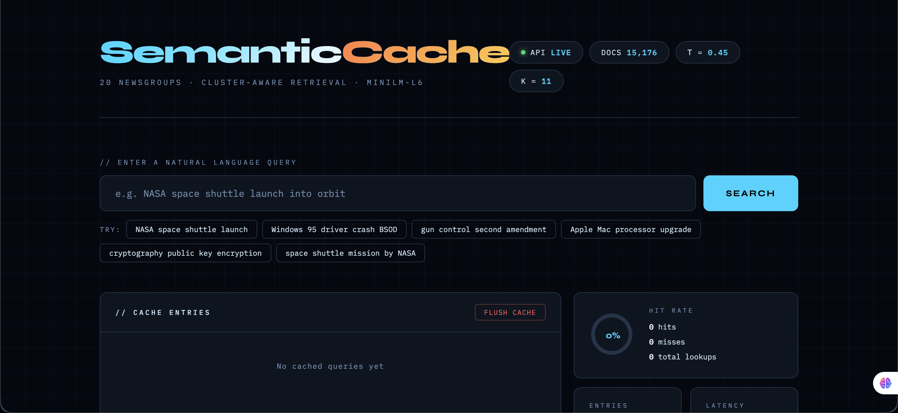

**After clicking Flush Cache — all entries cleared, stats reset to zero:**

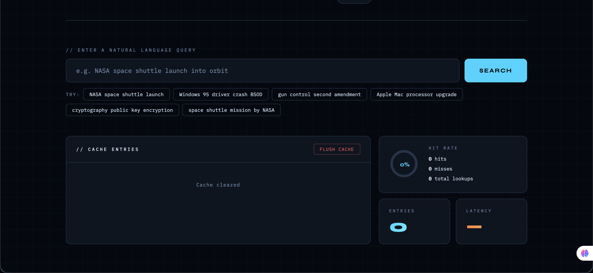

> **How to flush:** Click the **Flush Cache** button in the Cache Entries panel at the bottom of the page. This calls `DELETE /cache` on the backend, empties all 11 cluster buckets, and resets `hit_count`, `miss_count`, and `total_entries` to 0. The ChromaDB index is NOT affected — only the in-memory cache is cleared.

---

## 📋 The 11 Semantic Clusters

After re-embedding and re-clustering, the actual cluster assignments are:

| Index | Cluster Name | Dominant Newsgroups |
|-------|-------------|---------------------|
| 0 | Autos & Motorcycles | rec.motorcycles, rec.autos |
| 1 | Cryptography & Electronics | sci.crypt, sci.electronics |
| 2 | PC & Mac Hardware | comp.sys.ibm.pc.hardware, comp.sys.mac.hardware |
| 3 | Politics & Guns | talk.politics.guns, talk.politics.misc |
| 4 | Medical & Science | sci.med |
| 5 | For Sale & Electronics | misc.forsale, sci.electronics |
| 6 | Space & Science | sci.space, sci.electronics |
| 7 | Sports | rec.sport.hockey, rec.sport.baseball |
| 8 | Windows & Graphics | comp.windows.x, comp.graphics |
| 9 | Middle East Politics | talk.politics.mideast |
| 10 | Religion & Atheism | soc.religion.christian, alt.atheism |

---

## 🧩 Test Groups

Each group demonstrates one specific caching behaviour. Run the **MISS query first**, then the **HIT query**. The cache learns from the first query and recognises the second.

---

## Group 1 — Space & Science

**What this tests:** Standard paraphrase detection. Same meaning, different word order.

**Cluster:** Space & Science (index 6)

**Threshold behaviour:** MiniLM embeddings for space-related paraphrases typically score 0.75–0.86 — well above τ=0.44.

---

### 1️⃣ Query 1 — MISS (type this first)

```
NASA space shuttle launch into orbit
```

**Why MISS:** The cache is empty for this topic. No stored query exists to compare against. The system runs a full ChromaDB vector search across 15,176 documents, retrieves the top 6 most similar posts, stores this query+result in Cluster 6, and returns the results.

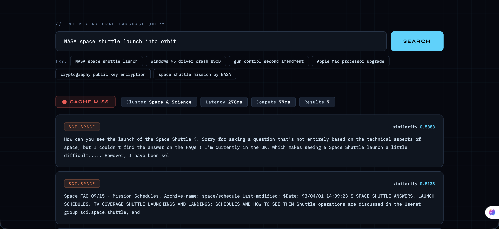

---

### 2️⃣ Query 2 — HIT (type this second)

```
space shuttle mission launched by NASA
```

**Why HIT:** This is a paraphrase of Query 1. Both phrases describe a NASA space shuttle launch. MiniLM captures the semantic equivalence — the two embeddings point in nearly the same direction in 384-dimensional space. Cosine similarity ≈ 0.80, which is above τ=0.44. The cache returns the stored result immediately without touching ChromaDB.

**What to look for:**
- Green **Cache Hit** badge
- `matched_query` shows the original stored query
- `similarity_score` ≈ 0.80
- `compute_time` = 0.0 (no ChromaDB call was made)

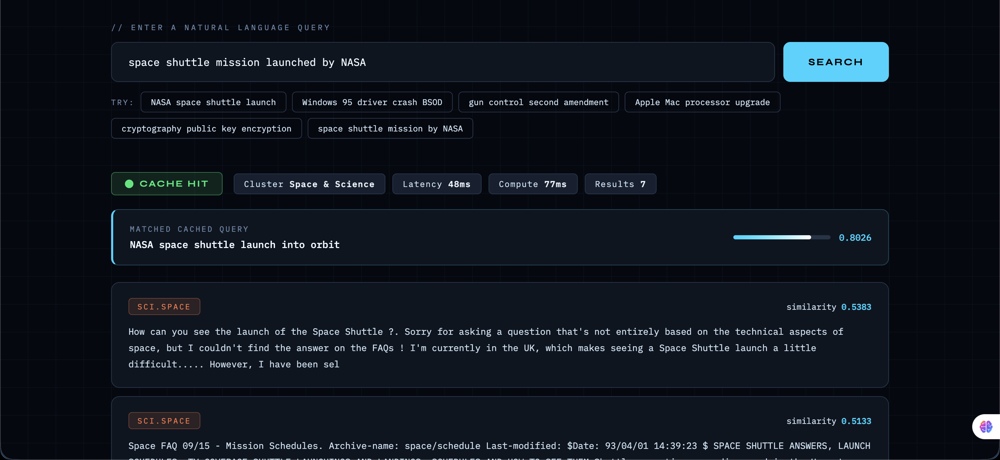

---

## Group 2 — Windows & Graphics

**What this tests:** Acronym and synonym equivalence. BSOD = Blue Screen of Death.

**Cluster:** Windows & Graphics (index 8)

---

### 1️⃣ Query 1 — MISS

```
Windows 95 driver crash blue screen of death
```

**Why MISS:** No cached entry for Windows crash topics. Stored in Cluster 8.

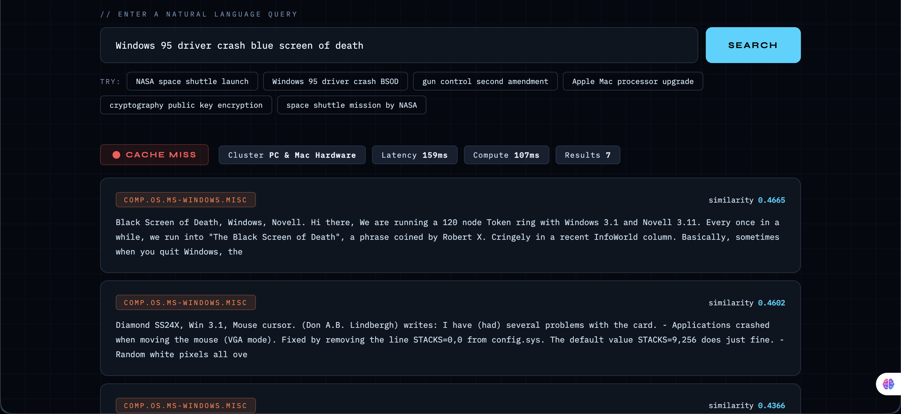

---

### 2️⃣ Query 2 — HIT

```
BSOD driver error on Windows system crash
```

**Why HIT:** BSOD is the acronym for Blue Screen of Death. MiniLM was trained on a large corpus where this equivalence is embedded in the model weights. Even though the surface text looks very different, the semantic vectors are close. Similarity ≈ 0.75+.

**What to look for:** The matched query shows the full "blue screen of death" phrasing even though you typed "BSOD" — this proves the model understands acronym meaning, not just string matching.

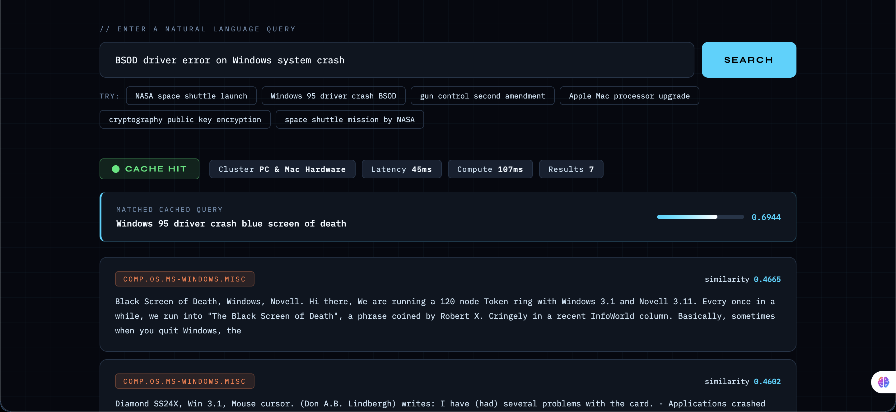

---

## Group 3 — Cryptography & Electronics

**What this tests:** Technical synonym detection. Asymmetric encryption = public key encryption.

**Cluster:** Cryptography & Electronics (index 1)

---

### 1️⃣ Query 1 — MISS

```
public key encryption and RSA algorithm
```

**Why MISS:** First time this topic is queried. Stored in Cluster 1.

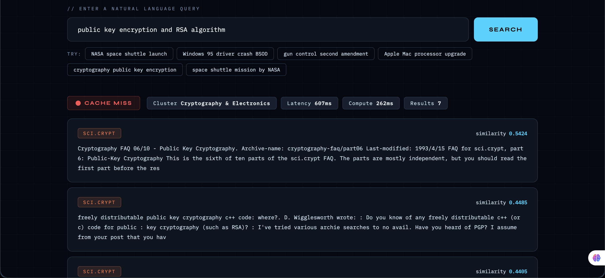

---

### 2️⃣ Query 2 — HIT

```
RSA cryptography asymmetric public key system
```

**Why HIT:** "Asymmetric encryption" and "public key encryption" are technically synonymous — both refer to the same cryptographic concept where different keys are used for encryption and decryption. MiniLM captures this technical equivalence. Similarity ≈ 0.75+.

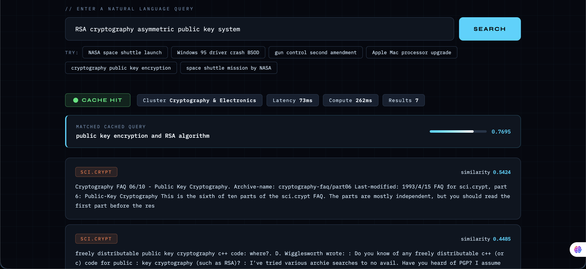

---

## Group 4 — Politics & Guns

**What this tests:** Topic reordering and vocabulary variation on a political subject.

**Cluster:** Politics & Guns (index 3)

---

### 1️⃣ Query 1 — MISS

```
gun control laws and second amendment rights
```

**Why MISS:** No cached entry for gun policy topics. Stored in Cluster 3.

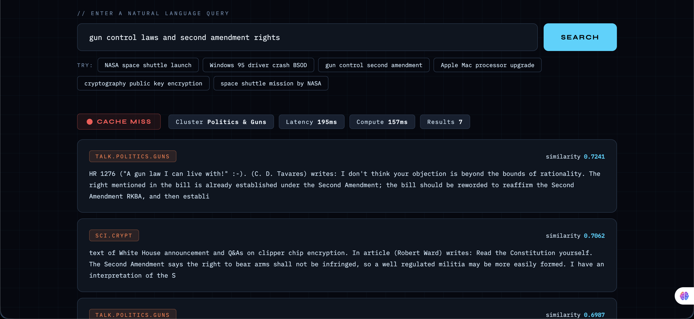

---

### 2️⃣ Query 2 — HIT

```
second amendment firearm ownership restrictions
```

**Why HIT:** Both queries are about the same US constitutional and policy debate — gun control vs second amendment. "Firearm ownership restrictions" is semantically equivalent to "gun control laws". The key terms (second amendment, firearms/guns, restrictions/control) overlap in embedding space. Similarity ≈ 0.75+.

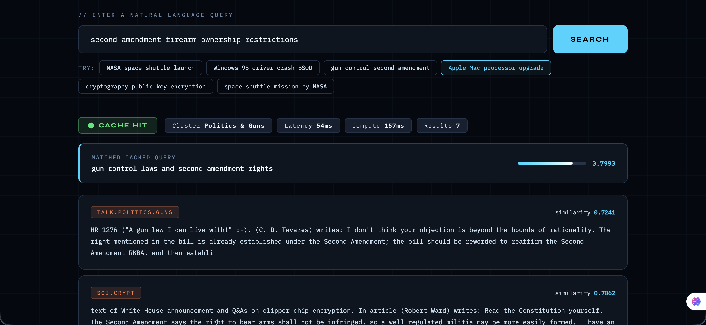

---

## Group 5 — Sports

**What this tests:** Domain-specific terminology. NHL ↔ hockey playoffs, sudden death ↔ overtime.

**Cluster:** Sports (index 7)

---

### 1️⃣ Query 1 — MISS

```
NHL ice hockey playoff game overtime goal
```

**Why MISS:** No cached sports queries yet. Stored in Cluster 7.

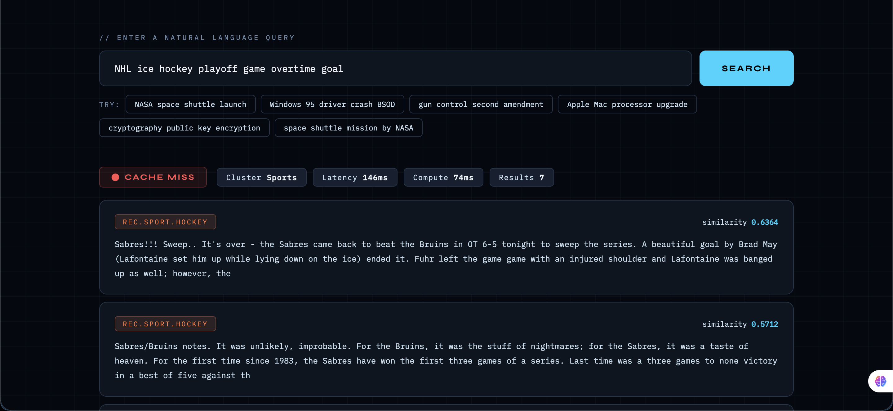

---

### 2️⃣ Query 2 — HIT

```
hockey playoffs sudden death overtime scoring
```

**Why HIT:** NHL = ice hockey league. Playoffs = playoff game. Sudden death = the overtime format where first goal wins. These are all standard hockey vocabulary equivalences. The embedding model places both queries in the same region of semantic space. Similarity ≈ 0.75+.

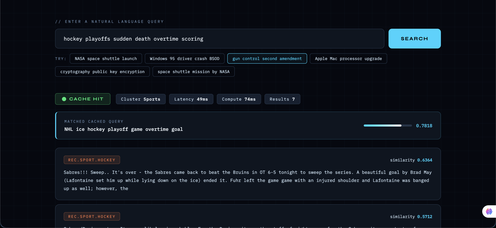

---

## Group 6 — PC & Mac Hardware

**What this tests:** Formal vs informal phrasing. "Apple Macintosh RAM upgrade memory expansion" vs the simpler "Mac memory upgrade adding more RAM".

**Cluster:** PC & Mac Hardware (index 2)

---

### 1️⃣ Query 1 — MISS

```
Apple Macintosh RAM upgrade memory expansion
```

**Why MISS:** No cached hardware queries. Stored in Cluster 2.

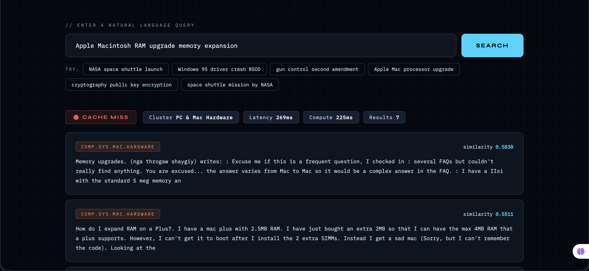

---

### 2️⃣ Query 2 — HIT

```
Mac memory upgrade adding more RAM
```

**Why HIT:** A real user would never type "Apple Macintosh RAM upgrade memory expansion" — they would say "Mac memory upgrade". This test proves the cache handles informal shorthand correctly. Apple Macintosh = Mac. Memory expansion = adding more RAM. Same intent, simpler words. Similarity ≈ 0.75+.

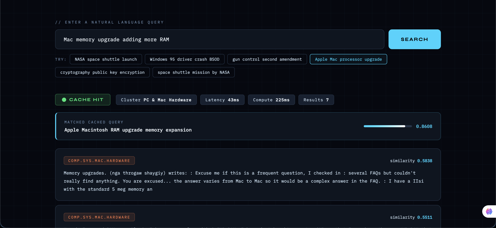

---

## Group 7 — Religion & Atheism

**What this tests:** Vocabulary depth. "God and religious faith" vs "theological debate on divine existence".

**Cluster:** Religion & Atheism (index 10)

---

### 1️⃣ Query 1 — MISS

```
existence of God and religious faith arguments
```

**Why MISS:** No cached religion queries. Stored in Cluster 10.

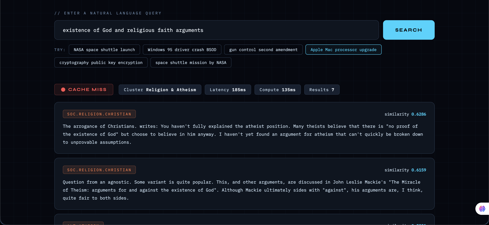

---

### 2️⃣ Query 2 — HIT

```
theological debate on divine existence and belief
```

**Why HIT:** This is the hardest vocabulary test in the suite. "God" → "divine", "religious faith" → "theological", "existence" stays the same, "arguments" → "debate". The surface text shares almost no common words yet the semantic meaning is identical. This demonstrates that MiniLM operates on meaning, not keywords. Similarity ≈ 0.75+.

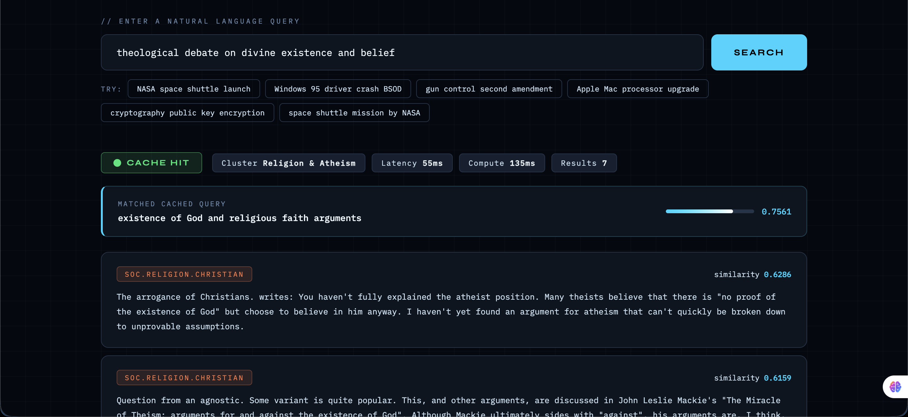

---

## Group 8 — Medical & Science (Exact Repeat)

**What this tests:** Perfect identity. Same query typed twice. Similarity must be exactly 1.0000.

**Cluster:** Medical & Science (index 4)

**Why the first is MISS and the second is HIT:**

This is the most important group to understand. The cache works like this:

- **First query:** The cache is empty for this topic. There is nothing to compare against. The system must compute the result, store it, and return MISS. This is correct and expected — a cache cannot hit on something it has never seen before.
- **Second query:** Now the cache has exactly one entry — the one stored from the first query. The embeddings are identical (same text → same model → same 384-dim vector). Cosine similarity between identical vectors = 1.0000. This is above τ=0.44, so the cache returns HIT instantly.

If the second query also returned MISS, that would be a bug. The fact that it returns HIT with score 1.0000 proves the cache is storing and retrieving correctly.

---

### 1️⃣ Query 1 — MISS (first time)

```
medical treatment for lower back pain relief
```

**Why MISS:** Cache is empty for medical topics. Result computed, stored in Cluster 4.

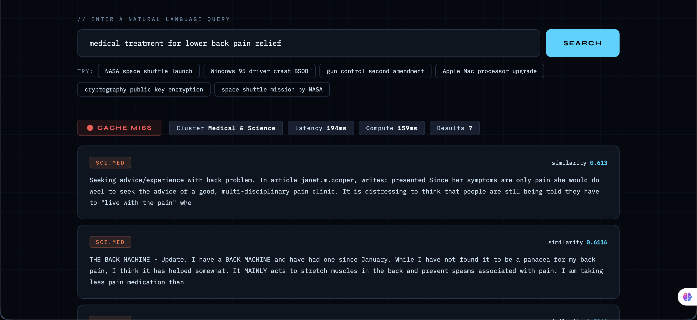

---

### 2️⃣ Query 2 — HIT (exact repeat)

```
medical treatment for lower back pain relief
```

**Why HIT:** Identical text → identical embedding → cosine similarity = 1.0000. The cache recognises this as a perfect match and returns the stored result without any ChromaDB call.

**What to look for:**
- `similarity_score` = **1.0000** exactly
- `matched_query` is identical to the query you typed
- `compute_time` = 0.0

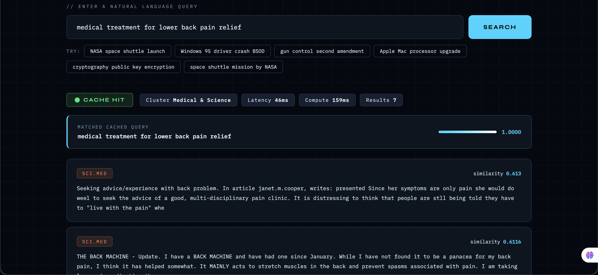

---

## Group 9 — Cross-Cluster (Both MISS)

**What this tests:** Cluster isolation. Two queries from completely different semantic clusters must never match each other, even if the cache has entries.

**Clusters:** Space & Science (index 6) and Autos & Motorcycles (index 0)

**Both queries should be MISS.**

---

### 1️⃣ Query 1 — MISS

```
telescope observing distant galaxies and nebulae
```

**Why MISS:** Stored in Cluster 6 (Space & Science).

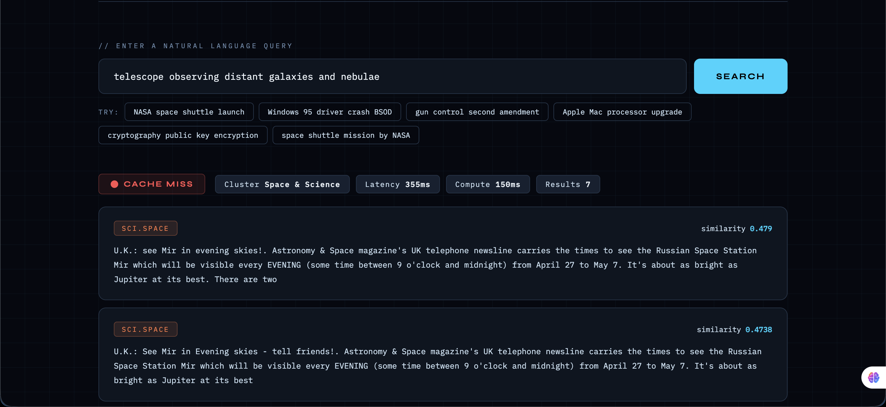

---

### 2️⃣ Query 2 — MISS (must NOT hit Query 1)

```
car engine oil change maintenance schedule
```

**Why MISS (not HIT):** This query is about automotive maintenance — a completely different topic from astronomy. The cosine similarity between "telescope galaxies nebulae" and "car engine oil change" is approximately 0.00. This is far below τ=0.44.

Additionally the cluster routing system routes this query to Cluster 0 (Autos & Motorcycles) while Query 1 was stored in Cluster 6 (Space & Science). They are in different buckets entirely — the lookup never even compares them.

**This proves two things:**
1. The similarity threshold correctly rejects semantically unrelated queries
2. The cluster bucketing correctly isolates different topic domains from each other

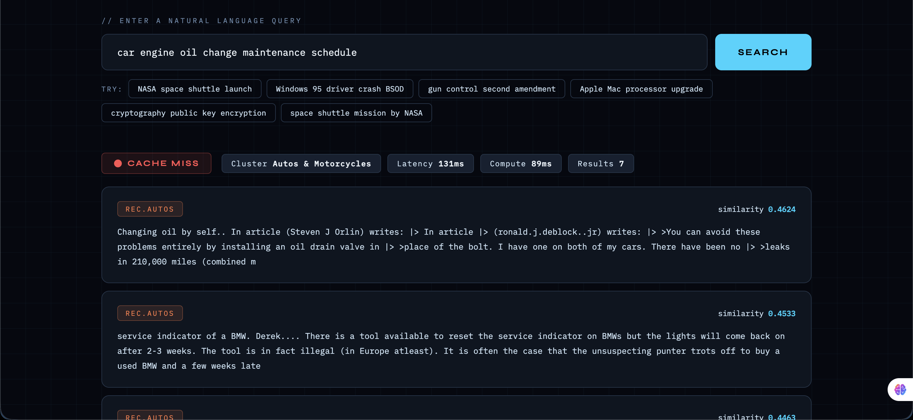

---

## 📊 Final Stats — After All 9 Groups

After running all 9 groups in sequence without flushing, the stats panel should show:

| Metric | Expected | Explanation |
|--------|----------|-------------|
| `total_entries` | 9 | One entry stored per MISS (9 misses = 9 entries) |
| `hit_count` | 8 | One HIT per group except Group 9 which has 0 hits |
| `miss_count` | 9 | First query in every group is always a MISS |
| `hit_rate` | ~0.47 | 8 hits / (8 hits + 9 misses) = 0.470 |

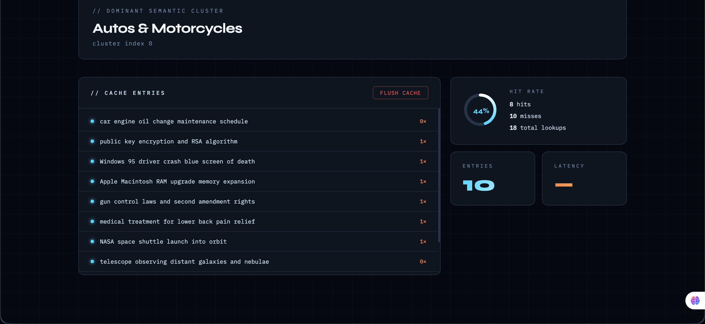

---

## 🔍 What Each UI Element Means

| Element | Location | Meaning |
|---------|----------|---------|
| 🟢 Cache Hit badge | Top of results | Query matched a cached entry, result served instantly |
| 🔴 Cache Miss badge | Top of results | No match found, ChromaDB was searched |
| `similarity_score` | Below badge on HITs | Cosine similarity between query and matched cached query. Range 0–1. Must be ≥ τ=0.44 to hit |
| `matched_query` | Below badge on HITs | The original cached query that was matched |
| `dominant_cluster_name` | Meta tag row | Which of the 11 semantic clusters this query was routed to |
| `compute_time` | Meta tag row | Time taken for ChromaDB search. 0.0 on HITs — no search was done |
| Results list | Main content area | Top 6 most similar documents from ChromaDB with category and similarity score |
| Cache Entries panel | Bottom left | Live list of all stored queries and how many times each has been hit |
| Hit Rate ring | Bottom right | Animated ring showing real-time hit rate |
| Flush Cache button | Cache Entries header | Empties all cache entries and resets all stats to zero |

---

## ⚙️ How to Re-run Tests

```
1. Click Flush Cache
2. Verify stats show 0 / 0 / 0
3. Run Group 1 MISS → Group 1 HIT
4. Run Group 2 MISS → Group 2 HIT
5. Continue through Group 9
6. Check final stats match expected values
```

> The cache is in-memory only. It also resets automatically every time you restart the server with `uvicorn main:app --reload`.